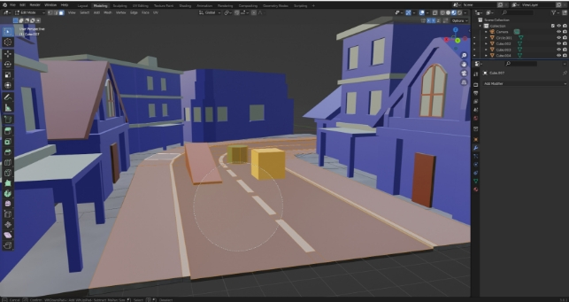
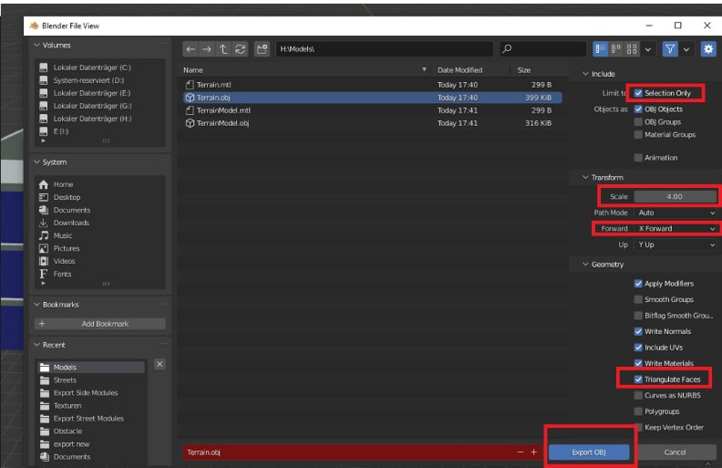
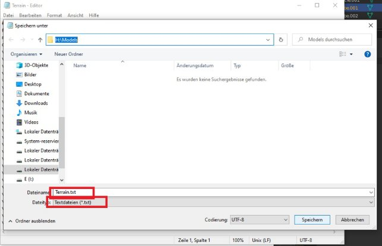
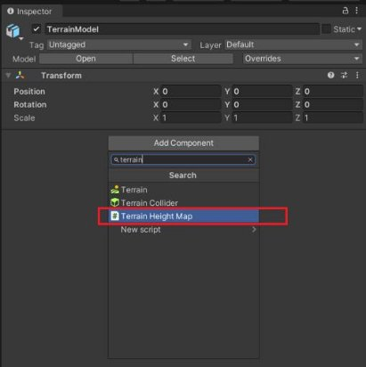
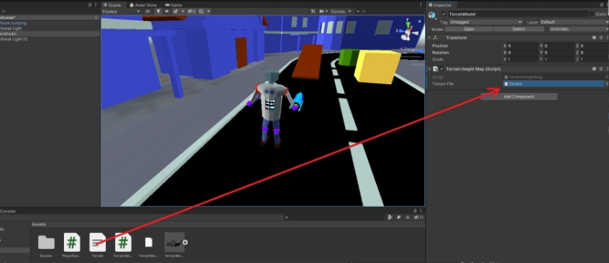
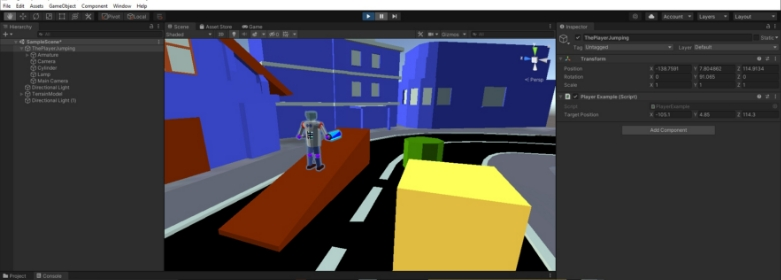

Step 0:

Add the TerrainHeightMap class to your Unity project.

Step 1:

In Blender you have to select all faces which are walkable.

Make sure the faces are not in the negative areas of the X/Y-Axes. Otherwise you need to customize the algorithm.

Step 2:

-After you select the faces press „Shift+D“ to duplicate the faces -Now press „P“ and choose „Seperate by Selection“

Step 3:

-Go in Object mode and select the seperated faces.

-Go to File→Export→Wavefront(.obj)

-Check „Selection Only“

-Select „X forward“ (depends on your model position)

-Check „Triangulate faces“

-Then you have to Scale properly. Remember that one element of the heightmap Array represents    the height of a unit-square. To get good results you need scale it bigger than the coordinate system.  E.g 1 Meter in the model needs 4 meters in the coordinatesystem (or even more).

` `-Now press export.

Step 4: 

-Open the .obj in a text editor

-Save the file with .txt extention

-Move the .txt file into your Unity project.

-Note: you can modify the code so that you don’t need a .txt file, but it could be easier to find txt       files under a lot of obj files

Step 5:

Add the TerrainHeightMap class to one of the Gameobjects in your scene.

Step 6:

Add the Terrain.txt file to the TerrainHeightMap Component.

Step 7:

-Now you can access the heightmap to get the height of a given position. -Check PlayerExample class for an example.

NOTE: Somehow Unity turns the sign of the X-coordinate of a OBJ model.

So you need to turn the sign too, to get the correct height of a coordinate.

The algorithm provides a heightmap solution for simple terrains. E.g it was used for the following Android game: **https://play.google.com/store/apps/details?id=com.arb.dev.ForestTrouble**
